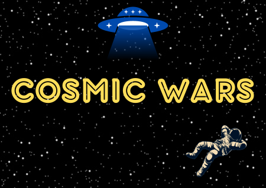

# Cosmic Wars - Universidad Nacional de Hurlingham.

# ¡Bienvenido a "Cosmic Wars"!
En este desafiante juego, tu objetivo es mantener al astronauta con vida y evitar que los aliens lo atrapen. Demuestra tu habilidad al mantener al astronauta a salvo. Supera tus límites y desafía a tus amigos en este emocionante desafío. 
¡Diviértete y disfruta de "Cosmic Wars"!

## Reglas del juego "Cosmic Wars:

1. Abre el juego "Cosmic Wars" en tu dispositivo o plataforma preferida.

2. Al comenzar el juego, verás un astronauta en la pantalla y alienígenas a su alrededor.

3. El objetivo del juego es guiar al astronauta a través de los espacios entre los alienígenas sin ser atrapado.

4. Evita no perder contra ningún alienígenas.

5. Mantén la concentración y los reflejos rápidos para tener éxito.

6. El juego termina si el astronauta se queda sin vidas.

7. Compite con tus amigos para ver quién obtiene la puntuación más alta.

# Instrucciones del juego "Cosmic Wars" (Teclas):

## Movimientos:

- Moverse hacia arriba: Presiona la tecla W.

- Moverse hacia abajo: Presiona la tecla S.

- Moverse hacia la izquierda: Presiona la tecla A.

- Moverse hacia la derecha: Presiona la tecla D.

## Defensa:

- Disparar (Balas): Presiona la tecla h. 

# Presentacion:

¡Diviértete jugando "Cosmic Wars" y desafía tus habilidades para llegar lo más lejos posible!

A medida que te sumerges en "Cosmic Wars", te animamos a explorar tu habilidad y determinación. Afronta los desafíos con valentía, disfruta de la emoción del juego, diviértete y demuestra tu perseverancia en cada intento. ¡Que esta experiencia en "Cosmic Wars" te inspire a superar tus propios límites en cualquier desafío que enfrentes en la vida!

# Nombre de los integrantes :
- Emanuel Ignacio Chavez
- Agustin Daniel Ojeda

